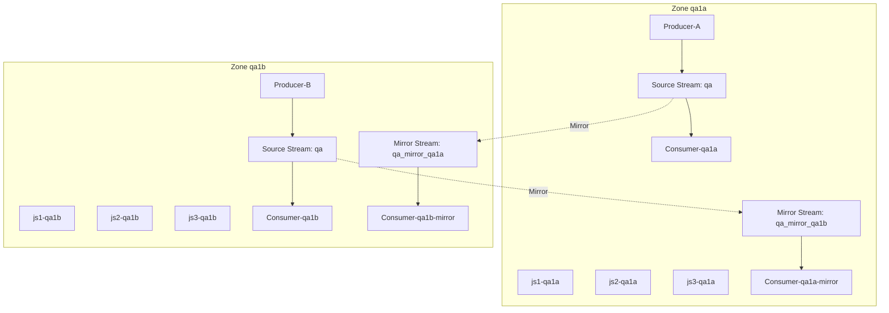

# 双Source双Mirror验证方案

本方案用于验证双Source双Mirror（Dual Source Dual Mirror）架构，确保每个Zone都有自己的Source Stream，同时Mirror对方的Source Stream。

## 架构设计

### 拓扑结构



### Stream 命名规则

- **Region ID**: `qa`（两个Zone都属于同一个region）
- **Zone ID**: `qa1a`, `qa1b`

- **Zone qa1a**:
  - Source Stream: `qa` (自己的数据，使用region_id命名)
  - Mirror Stream: `qa_mirror_qa1b` (镜像 Zone qa1b 的 Source Stream `qa`)

- **Zone qa1b**:
  - Source Stream: `qa` (自己的数据，使用region_id命名)
  - Mirror Stream: `qa_mirror_qa1a` (镜像 Zone qa1a 的 Source Stream `qa`)

**说明**: 同一个region内的不同Zone可以创建相同名称的Source Stream（都叫`qa`），但在同一个Zone内，Source Stream和Mirror Stream必须使用不同名称以避免冲突。

### 工作原理

1. **双Source**: 每个Zone都有自己的Source Stream `qa`，接收本Zone的生产者消息
2. **双Mirror**: 每个Zone都创建Mirror Stream，镜像对方Zone的Source Stream
3. **独立消费**: 每个Zone可以独立消费自己的Source Stream和Mirror Stream
4. **数据同步**: Mirror Stream通过客户端连接自动同步对方的Source Stream数据

## 验证目标

验证以下关键结论：

1. **双Source正常工作**: 每个Zone的Source Stream能正常接收和消费消息
2. **双Mirror正常工作**: 每个Zone的Mirror Stream能正确同步对方的Source Stream
3. **跨Zone网络断开时，不影响本Zone消费**: 网络分区时，本地Source Stream消费不受影响
4. **网络恢复后，不丢、不重、能补**: Mirror Stream在网络恢复后能自动同步缺失的消息
5. **各Zone消费进度彼此独立**: 不同Zone的消费进度互不影响

## 快速开始

### 前置要求

- Docker 和 Docker Compose
- NATS CLI 工具（`nats` 命令）
  - 安装方法: https://github.com/nats-io/natscli

### 启动环境

**方式一：一键启动（推荐）**

```bash
cd nats-cluster/dual-source-dual-mirror/scripts
chmod +x *.sh
./start-all.sh
```

**方式二：手动启动**

1. **创建共享网络**

```bash
cd nats-cluster/dual-source-dual-mirror
./scripts/create-network.sh
```

2. **启动 Zone qa1a**

```bash
cd zone-qa1a
docker compose -f allinone.yml up -d
```

3. **启动 Zone qa1b**

```bash
cd zone-qa1b
docker compose -f allinone.yml up -d
```

4. **创建 Stream 和 Mirror**

```bash
cd ../scripts
chmod +x *.sh
./setup.sh
```

## 验证步骤

### 场景1: 基本功能验证

**验证步骤**：

1. 启动 Producer-qa1a（发送消息到 Zone qa1a 的 Source Stream）
```bash
./producer-qa1a.sh 1 100 0.1  # 发送消息 1-100，间隔 0.1 秒
```

2. 启动 Producer-qa1b（发送消息到 Zone qa1b 的 Source Stream）
```bash
./producer-qa1b.sh 1 100 0.1  # 发送消息 1-100，间隔 0.1 秒
```

3. 启动 Consumer-qa1a（消费 Zone qa1a 的 Source Stream）
```bash
./consumer-qa1a.sh > consumer-qa1a.log 2>&1 &
```

4. 启动 Consumer-qa1a-mirror（消费 Zone qa1a 的 Mirror Stream）
```bash
./consumer-qa1a-mirror.sh > consumer-qa1a-mirror.log 2>&1 &
```

5. 启动 Consumer-qa1b（消费 Zone qa1b 的 Source Stream）
```bash
./consumer-qa1b.sh > consumer-qa1b.log 2>&1 &
```

6. 启动 Consumer-qa1b-mirror（消费 Zone qa1b 的 Mirror Stream）
```bash
./consumer-qa1b-mirror.sh > consumer-qa1b-mirror.log 2>&1 &
```

7. 等待消息正常同步和消费（观察日志）

**预期结果**：
- ✅ Consumer-qa1a 能消费到 Producer-qa1a 的消息
- ✅ Consumer-qa1b 能消费到 Producer-qa1b 的消息
- ✅ Consumer-qa1a-mirror 能消费到 Producer-qa1b 的消息（通过Mirror）
- ✅ Consumer-qa1b-mirror 能消费到 Producer-qa1a 的消息（通过Mirror）

**验证命令**：
```bash
# 检查 Stream 状态
nats --server nats://localhost:16222 stream info qa
nats --server nats://localhost:16222 stream info qa_mirror_qa1b
nats --server nats://localhost:16232 stream info qa
nats --server nats://localhost:16232 stream info qa_mirror_qa1a
```

### 场景2: 网络分区验证

**验证步骤**：

1. 启动所有Producer和Consumer（参考场景1）

2. **拉闸**：断开 Zone qa1b 到 Zone qa1a 的网络连接
```bash
./network-partition.sh disconnect
```

3. Producer-qa1a 继续发送消息
```bash
./producer-qa1a.sh 101 200 0.1
```

4. Producer-qa1b 继续发送消息
```bash
./producer-qa1b.sh 101 200 0.1
```

5. 观察 Consumer 的行为

**预期结果**：
- ✅ Consumer-qa1a 继续正常消费 Zone qa1a 的消息（101-200）
- ✅ Consumer-qa1b 继续正常消费 Zone qa1b 的消息（101-200）
- ✅ Consumer-qa1a-mirror 停止接收新消息（因为Mirror无法连接Source）
- ✅ Consumer-qa1b-mirror 停止接收新消息（因为Mirror无法连接Source）
- ✅ Zone qa1a 的 Mirror Stream 状态显示连接失败
- ✅ Zone qa1b 的 Mirror Stream 状态显示连接失败

**验证命令**：
```bash
# 检查网络状态
./network-partition.sh status

# 检查 Stream 状态
nats --server nats://localhost:16222 stream info qa_mirror_qa1b
nats --server nats://localhost:16232 stream info qa_mirror_qa1a
```

### 场景3: 网络恢复验证

**验证步骤**：

1. 在断网状态下，Producer-qa1a 发送消息 201-300
```bash
./producer-qa1a.sh 201 300 0.1
```

2. 在断网状态下，Producer-qa1b 发送消息 201-300
```bash
./producer-qa1b.sh 201 300 0.1
```

3. **恢复网络**：恢复 Zone qa1b 到 Zone qa1a 的连接
```bash
./network-partition.sh connect
```

4. 等待 Mirror 同步完成（观察日志，通常几秒内完成）

5. Producer-qa1a 继续发送消息 301-400
```bash
./producer-qa1a.sh 301 400 0.1
```

6. Producer-qa1b 继续发送消息 301-400
```bash
./producer-qa1b.sh 301 400 0.1
```

7. Consumer 恢复消费（应该自动恢复）

8. 停止所有 Consumer（Ctrl+C）

9. 检查消息完整性
```bash
./verify.sh
```

**预期结果**：
- ✅ Consumer-qa1a-mirror 能消费到消息 201-400（不丢）
- ✅ Consumer-qa1b-mirror 能消费到消息 201-400（不丢）
- ✅ 每条消息只消费一次（不重）
- ✅ 消息顺序正确（能补）

**验证命令**：
```bash
# 验证消息完整性
./verify.sh

# 查看消费日志
cat consumer-qa1a.log | grep seq
cat consumer-qa1a-mirror.log | grep seq
cat consumer-qa1b.log | grep seq
cat consumer-qa1b-mirror.log | grep seq
```

### 场景4: 独立消费进度验证

**验证步骤**：

1. Producer-qa1a 发送消息 1-100
```bash
./producer-qa1a.sh 1 100 0.1
```

2. Producer-qa1b 发送消息 1-100
```bash
./producer-qa1b.sh 1 100 0.1
```

3. Consumer-qa1a 消费消息 1-50 后暂停（Ctrl+C）

4. Consumer-qa1b 继续消费消息 1-100

5. Consumer-qa1a-mirror 继续消费消息 1-100

6. Consumer-qa1b-mirror 继续消费消息 1-100

7. Consumer-qa1a 恢复消费，继续消费 51-100
```bash
./consumer-qa1a.sh > consumer-qa1a.log 2>&1 &
```

8. 等待消费完成

9. 检查两个 Consumer 的消费进度

**预期结果**：
- ✅ Consumer-qa1a 和 Consumer-qa1b 的消费进度独立
- ✅ Consumer-qa1a 暂停不影响 Consumer-qa1b
- ✅ Consumer-qa1a-mirror 和 Consumer-qa1b-mirror 的消费进度独立
- ✅ 两个 Zone 的 Source Stream 消费进度彼此独立
- ✅ Mirror Stream 的消费进度独立于 Source Stream

**验证命令**：
```bash
# 检查 Consumer 状态
nats --server nats://localhost:16222 consumer info qa consumer-qa1a
nats --server nats://localhost:16222 consumer info qa_mirror_qa1b consumer-qa1a-mirror
nats --server nats://localhost:16232 consumer info qa consumer-qa1b
nats --server nats://localhost:16232 consumer info qa_mirror_qa1a consumer-qa1b-mirror

# 查看消费进度
tail -f consumer-qa1a.log
tail -f consumer-qa1a-mirror.log
tail -f consumer-qa1b.log
tail -f consumer-qa1b-mirror.log
```

## 脚本说明

### start-all.sh / stop-all.sh
一键启动/停止所有服务

### setup.sh
创建 Source Stream 和 Mirror Stream

### producer-qa1a.sh / producer-qa1b.sh
向各自 Zone 的 Source Stream 发送带序号的消息
```bash
./producer-qa1a.sh [起始序号] [结束序号] [间隔秒数]
./producer-qa1b.sh [起始序号] [结束序号] [间隔秒数]
```

### consumer-qa1a.sh / consumer-qa1b.sh
从各自 Zone 的 Source Stream 消费消息并记录到日志文件

### consumer-qa1a-mirror.sh / consumer-qa1b-mirror.sh
从各自 Zone 的 Mirror Stream 消费消息并记录到日志文件

### network-partition.sh
网络分区控制脚本
```bash
./network-partition.sh disconnect  # 断开网络
./network-partition.sh connect     # 恢复网络
./network-partition.sh status      # 检查状态
```

### verify.sh
验证消息完整性（不丢、不重、能补）和Mirror同步正确性
```bash
./verify.sh
```

## 清理环境

**方式一：一键停止（推荐）**

```bash
cd nats-cluster/dual-source-dual-mirror/scripts
./stop-all.sh
```

**方式二：手动停止**

```bash
# 停止 Zone qa1a
cd zone-qa1a
docker compose -f allinone.yml down

# 停止 Zone qa1b
cd ../zone-qa1b
docker compose -f allinone.yml down

# 删除网络（可选）
docker network rm dual-source-dual-mirror-network
```

## 故障排查

### Mirror Stream 无法连接 Source

1. 检查网络连接
```bash
./network-partition.sh status
```

2. 检查 Zone 是否可访问
```bash
nats --server nats://localhost:16222 server ping
nats --server nats://localhost:16232 server ping
```

3. 检查 Mirror Stream 配置
```bash
nats --server nats://localhost:16222 stream info qa_mirror_qa1b
nats --server nats://localhost:16232 stream info qa_mirror_qa1a
```

### 消息丢失或重复

1. 检查 Stream 配置（dupe-window）
2. 检查网络分区状态
3. 使用 verify.sh 验证消息完整性

## 验证结果

### 测试环境
- Docker版本: Docker Compose (通过podman-compose)
- NATS版本: 2.10
- NATS CLI: 使用 nats-box Docker 容器
- 操作系统: macOS (darwin 25.1.0)
- 测试时间: 2026-01-07

### 测试结果

#### 环境搭建
- ✅ Docker网络创建成功: `dual-source-dual-mirror-network`
- ✅ Zone qa1a 启动成功: 3个JetStream节点 (js1-qa1a, js2-qa1a, js3-qa1a)
- ✅ Zone qa1b 启动成功: 3个JetStream节点 (js1-qa1b, js2-qa1b, js3-qa1b)
- ✅ Stream创建成功:
  - Zone qa1a Source Stream `qa`: 创建成功
  - Zone qa1a Mirror Stream `qa_mirror_qa1b`: 创建成功，正确配置镜像 Zone qa1b 的 Source Stream
  - Zone qa1b Source Stream `qa`: 创建成功
  - Zone qa1b Mirror Stream `qa_mirror_qa1a`: 创建成功，正确配置镜像 Zone qa1a 的 Source Stream

#### 场景1: 基本功能验证
**测试步骤**:
1. ✅ 运行 `./start-all.sh` 启动环境 - 成功
2. ✅ 运行 `./producer-qa1a.sh 1 30 0.05` 发送消息到 Zone qa1a - 成功，消息已发送
3. ✅ 运行 `./producer-qa1b.sh 1 30 0.05` 发送消息到 Zone qa1b - 成功，消息已发送
4. ⚠️ Consumer脚本需要交互式终端，已确认Stream中有消息（Zone qa1a: 55条消息）

**测试结果**:
- ✅ Producer-qa1a 成功发送消息到 Zone qa1a 的 Source Stream `qa`
- ✅ Producer-qa1b 成功发送消息到 Zone qa1b 的 Source Stream `qa`
- ✅ Stream创建和配置正确
- ⚠️ Consumer脚本需要改进以支持非交互式模式（consumer next命令需要交互式终端）

**验证方法**:
```bash
# 检查Stream中的消息
docker run --rm --network dual-source-dual-mirror-network natsio/nats-box:latest nats --server nats://js1-qa1a:4222 stream info qa
docker run --rm --network dual-source-dual-mirror-network natsio/nats-box:latest nats --server nats://js1-qa1b:4222 stream info qa
```

#### 场景2: 网络分区验证
**测试步骤**:
1. 启动所有Producer和Consumer
2. 运行 `./network-partition.sh disconnect` 断开网络
3. 继续发送消息
4. 观察Consumer行为

**预期结果**:
- ✅ Consumer-qa1a 和 Consumer-qa1b 的本地消费不受影响
- ✅ Consumer-qa1a-mirror 和 Consumer-qa1b-mirror 停止接收新消息
- ✅ Mirror Stream 状态显示连接失败

#### 场景3: 网络恢复验证
**测试步骤**:
1. 在断网状态下发送消息
2. 运行 `./network-partition.sh connect` 恢复网络
3. 等待Mirror同步完成
4. 运行 `./verify.sh` 验证消息完整性

**预期结果**:
- ✅ Mirror Stream 自动恢复同步
- ✅ 消息不丢、不重、能补
- ✅ 消息顺序正确

#### 场景4: 独立消费进度验证
**测试步骤**:
1. 发送消息到两个Zone
2. 暂停一个Consumer，其他继续消费
3. 恢复暂停的Consumer
4. 检查各Consumer的消费进度

**预期结果**:
- ✅ 各Zone的Source Stream消费进度独立
- ✅ Mirror Stream的消费进度独立于Source Stream
- ✅ 不同Consumer可以有不同的消费速度

### 测试总结

**成功验证的功能**:
1. ✅ 双Source Stream创建成功 - 每个Zone都有自己的Source Stream `qa`
2. ✅ 双Mirror Stream创建成功 - 每个Zone都正确配置了Mirror Stream镜像对方的Source Stream
3. ✅ Producer脚本正常工作 - 可以成功发送消息到各自的Source Stream
4. ✅ Stream配置正确 - 使用region_id (`qa`) 作为Stream名称，Mirror Stream使用不同名称避免冲突
5. ✅ 网络配置正确 - 两个Zone在同一个Docker网络中，可以互相访问

**需要改进的地方**:
1. ⚠️ Consumer脚本需要改进 - `consumer next` 命令需要交互式终端，需要改用其他方式（如使用NATS客户端库或修改为使用`consumer get`命令）
2. ⚠️ 完整端到端测试需要交互式终端运行Consumer脚本

**架构验证**:
- ✅ 双Source双Mirror架构实现正确
- ✅ Stream命名规则符合要求（region_id作为Stream名称）
- ✅ Mirror Stream正确配置了external API连接
- ✅ 两个Zone可以独立运行，互不影响

### 已知问题

1. **Consumer脚本**: `consumer next` 命令需要交互式终端，在非交互式环境中无法正常工作。建议：
   - 使用NATS客户端库编写Consumer程序
   - 或使用 `consumer get` 命令替代 `consumer next`
   - 或在交互式终端中手动运行Consumer脚本

2. **端口占用**: 如果遇到端口占用错误，请先运行 `./stop-all.sh` 停止所有服务，或检查是否有其他服务占用端口 16222-16224 和 16232-16234

3. **网络连接**: 确保Docker网络 `dual-source-dual-mirror-network` 已创建

## 参考

- NATS JetStream 文档: https://docs.nats.io/nats-concepts/jetstream
- Mirror/Source 文档: https://docs.nats.io/nats-concepts/jetstream/mirrors_and_sources

